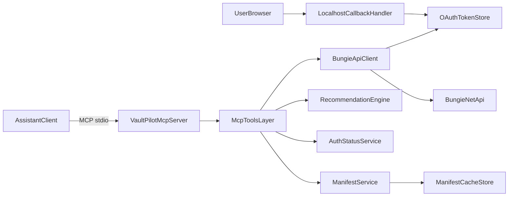

# VaultPilot MVP Implementation Plan

## 1) Product Summary
VaultPilot is a read-only MCP server for Destiny 2 that enables MCP-compatible assistants to fetch and analyze player data via Bungie.net APIs, then return cautious, explainable recommendations without mutating game state.

## 2) MVP Scope
- Local-only stdio MCP transport.
- Read-only Bungie API client with resilient request primitives.
- OAuth scaffolding centered on localhost callback completion flow.
- Token storage abstraction + local file implementation.
- Manifest caching architecture + local cache implementation.
- Profile and inventory normalization into assistant-friendly domain models.
- Conservative recommendation engine (advisory only, confidence-gated).
- Response-size controls (limits + optional detail flags) for all data-heavy tools.
- Automated tests (unit + integration with mocked services and mocked Bungie responses).
- Documentation for setup, auth flow, tool usage, and safety boundaries.

Primary files/folders to introduce and evolve:
- [docs/IMPLEMENTATION_PLAN.md](docs/IMPLEMENTATION_PLAN.md)
- [docs/ASSUMPTIONS.md](docs/ASSUMPTIONS.md)
- [docs/ARCHITECTURE.md](docs/ARCHITECTURE.md)
- [docs/TOOLS.md](docs/TOOLS.md)
- [docs/SECURITY.md](docs/SECURITY.md)
- [package.json](package.json)
- [src/server/index.ts](src/server/index.ts)
- [src/mcp/tools](src/mcp/tools)
- [src/bungie/client.ts](src/bungie/client.ts)
- [src/bungie/oauth](src/bungie/oauth)
- [src/storage/token-store.ts](src/storage/token-store.ts)
- [src/storage/manifest-cache.ts](src/storage/manifest-cache.ts)
- [src/normalize](src/normalize)
- [src/recommend](src/recommend)
- [tests](tests)

## 3) Explicit Non-Goals
- No web dashboard/UI.
- No item movement.
- No equip/unequip actions.
- No lock/unlock actions.
- No loadout apply support.
- No dismantle support.
- No Bungie write scopes.
- No DIM inventory integration.
- No cloud deployment and no multi-tenant auth broker in MVP.

## 4) Assumptions
- Runtime: modern Node.js LTS with TypeScript strict mode.
- MCP SDK decision: use `@modelcontextprotocol/sdk` stable v1 imports consistently across the codebase (no v2 mixing).
- Bungie OAuth app credentials are provided out-of-band via env vars.
- Bungie OAuth requests must not include a dynamic `scope` query parameter; scopes are configured in Bungie app settings.
- MVP read access is limited to Bungie scopes equivalent to `ReadBasicUserProfile` and `ReadDestinyInventoryAndVault`; no write scopes requested.
- Initial token persistence can be local filesystem with OS-user-level permissions.
- Manifest cache can start file-based and be refreshed by explicit tool/admin command and TTL.
- MVP targets one player account context at a time per configured token set.
- Recommendation quality prioritizes correctness/safety over breadth.

## 5) Recommended Package/Dependency List
Runtime:
- `@modelcontextprotocol/sdk@^1` (stable v1 transport/server APIs; pinned to v1 family).
- `zod` (tool input/output schema validation + parsing).
- `undici` or native `fetch` wrapper (HTTP client with robust timeout/retry control).
- `pino` (structured logs, redaction support).
- `keyv` (optional abstraction for pluggable caches/stores) or custom minimal interfaces.

Dev/Test:
- `typescript`
- `tsx` (dev runner)
- `vitest` (unit/integration test runner)
- `@vitest/coverage-v8`
- `msw` or `nock` (HTTP mocking)
- `eslint` + `@typescript-eslint/*`
- `prettier`

Deferred/optional (not required in phase 1):
- `keytar` (secure OS credential storage), introduced when moving beyond file token store.

## 6) Folder Structure
Proposed layout:
- [src/server](src/server): MCP server bootstrap, stdio wiring, localhost callback lifecycle.
- [src/mcp](src/mcp): tool registry, contracts, handlers.
- [src/bungie](src/bungie): HTTP client, endpoint wrappers, OAuth primitives.
- [src/storage](src/storage): token and manifest store interfaces + local implementations.
- [src/manifest](src/manifest): manifest fetch/index/query logic.
- [src/normalize](src/normalize): raw Bungie -> normalized domain transforms.
- [src/recommend](src/recommend): rules, scoring, confidence/explainability.
- [src/domain](src/domain): shared types for profile/inventory/activities/currency.
- [tests/unit](tests/unit): isolated logic tests.
- [tests/integration](tests/integration): MCP handler + service-layer tests with mocks.
- [docs](docs): architecture, operations, auth, assumptions.

## 7) MCP Tool Contracts
Initial tool set (read-only, split for narrow payloads):
- `auth_start`: returns Bungie authorize URL + state nonce, and starts/ensures localhost callback listener metadata.
- `auth_status`: returns current auth state (authenticated, expired, refreshing, missing token) with masked account metadata.
- `auth_logout`: clears local token state and returns signed-out status.
- `manifest_status_get`: cache version, age, staleness, source metadata.
- `player_profile_get`: normalized account/character profile summary.
- `vault_items_get`: vault-only item list and aggregates.
- `character_inventory_get`: one-character inventory/equipped snapshot by characterId.
- `currencies_get`: normalized currency balances and notable caps.
- `quests_bounties_get`: normalized quests/bounties/status overview.
- `recommendations_get`: conservative recommendations + rationale + confidence.

Contract rules:
- Every tool has strict input schema validation and explicit error taxonomy.
- Every response includes `data`, `meta`, and `warnings`.
- Response-size strategy is mandatory:
  - default `detail="summary"` for all list-heavy tools.
  - optional `detail="full"` flag for expanded fields.
  - cursor pagination via `limit` and `cursor`.
  - hard upper bounds (for example `limit <= 100`) with truncation metadata.
- No tool accepts mutation intents (enforced by schema and handler guards).

## 8) Bungie API Integration Plan
Client layers:
- Transport core: timeout, retry with backoff, rate-limit awareness, Bungie error mapping.
- Endpoint adapters: profile, inventory, character, milestones/progress, manifest.
- Response guards: runtime decoding and graceful degradation for partial responses.

Implementation approach:
- Build a small `BungieApiClient` interface first, then concrete REST implementation.
- Centralize headers (`X-API-Key`, auth bearer token) and auth concerns.
- Normalize Bungie error codes into internal categories (`AuthError`, `RateLimitError`, `UpstreamError`, `NotFoundError`).
- Add deterministic fixtures from real response shapes for stable tests.
- MVP `GetProfile` component preset should include only required components for current tools and keep `ItemReusablePlugs` opt-in only behind a feature flag/tool option.

## 9) OAuth/Token Storage Plan
OAuth scaffolding:
- `auth_start` builds the authorize URL and state nonce for browser launch.
- OAuth completion occurs through a localhost callback handler (primary path), not through an MCP `auth_complete` exchange tool.
- Callback handler exchanges code for access/refresh token and persists through `TokenStore`.
- Token refresh pipeline invoked transparently by API client when expired.
- Bungie OAuth requests must not include dynamic `scope`; only app-configured read-only scopes are used.

Token storage abstraction:
- `TokenStore` interface: get/set/delete/list metadata operations.
- `FileTokenStore` MVP implementation under local app data directory.
- Store minimal required fields; never log raw token values.
- Future-ready adapter slot for secure OS keychain-backed implementation.

## 10) Manifest Caching Plan
Architecture:
- `ManifestCache` interface with versioned metadata + component access methods.
- Local file cache with index metadata (`version`, `updatedAt`, `ttl`, checksum if available).
- Fetch-on-miss + stale-while-revalidate option for non-blocking reads.
- Explicit refresh path/tool for user-controlled updates.

Behavior:
- Cache integrity check before serving.
- Safe fallback when manifest unavailable (limited recommendations + warnings).
- Metrics/log fields for cache hit/miss/stale/refresh errors.

## 11) Data Normalization Plan
Create stable domain models separating raw Bungie shapes from tool outputs:
- Profile model: membership, characters, power summary, class/race/light-level snapshots.
- Inventory model: equipped, character inventories, vault, bucket/category grouping.
- Progress model: quests/bounties, currencies, key milestones/triumph indicators.

Normalization rules:
- Resolve hash-based definitions through manifest lookup layer.
- Keep provenance fields (`sourceComponent`, `retrievedAt`) for auditability.
- Mark unknown or missing fields explicitly rather than silently dropping.
- Produce compact default views first, then enrich when `detail="full"` is requested.

## 12) Recommendation Engine Plan
MVP strategy: conservative, deterministic rule engine.
- Inputs: normalized inventory/progress + manifest metadata + optional weekly context.
- Output categories:
  - `vault_hygiene`
  - `power_progression`
  - `objective_priorities`
- Confidence gating: emit recommendation only when threshold and required evidence are met.
- Explainability: each recommendation includes `why`, `evidence`, `confidence`, `safetyNotes`, and `category`.

Guardrails:
- Never imply that actions were executed.
- Banned destructive language in outputs: avoid words/phrases such as `dismantle`, `delete`, `trash`, `junk`, `scrap`, `purge`.
- Prefer advisory phrasing such as "consider reviewing" and "candidate for evaluation."
- Return `"insufficient_data"` outcomes when evidence is weak.

## 13) Safety/Security Plan
- Enforce read-only boundary at tool registry and handler levels.
- Scope OAuth strictly to read-only Bungie access (`ReadBasicUserProfile`, `ReadDestinyInventoryAndVault` equivalent capability).
- Never request or handle Bungie write scopes in MVP.
- Secrets via environment variables; token values redacted in logs.
- Local token file permissions tightened (owner read/write only where OS supports).
- Input validation and output sanitization for all MCP tool paths.
- Dependency and license hygiene documented before public distribution.

## 14) Test Plan
Unit tests:
- Schema validation, normalization mappers, recommendation rules, cache policy logic.
- Response-size policy tests (`summary` vs `full`, limit bounds, cursor pagination metadata).

Integration tests:
- MCP tool handlers with mocked token store, manifest cache, and mocked Bungie API.
- Localhost callback OAuth flow tests (`auth_start` -> callback -> `auth_status`).
- Error propagation: rate limits, expired tokens, malformed upstream payloads.

Contract tests:
- Snapshot/tool-contract assertions to ensure stable assistant-facing output shapes.

Quality gates:
- Typecheck, lint, test required in CI before merge.
- Coverage targets (initially pragmatic): critical modules >=80%.

## 15) Step-by-Step Implementation Phases
1. **Phase 1 (Mock-first foundation)**: project bootstrap, quality tooling, MCP stdio skeleton, split tool contracts, response-size policy, and docs. All tool handlers run against mocked auth/profile/inventory/manifest services.
2. **Phase 2 (Mock-first domain behavior)**: normalization layer, recommendation engine categories/guardrails, and end-to-end MCP contract tests using mocked services only.
3. **Phase 3 (Real Bungie integration)**: Bungie transport/client, OAuth localhost callback exchange, token refresh, and read-only scope enforcement.
4. **Phase 4 (Manifest + live data plumbing)**: manifest cache implementation, GetProfile component preset tuning, and wiring live profile/inventory/progress adapters.
5. **Phase 5 (Hardening and release docs)**: integration test expansion, security review checklist, docs finalization, and MVP release checklist.

## 16) Risks and Open Questions
Top risks:
- Bungie API shape variability and sparse/partial components.
- Localhost callback reliability across OS/firewall/security prompts.
- Manifest size/performance trade-offs on first load.
- Overconfident recommendations without enough context.

Open questions to resolve before coding begins:
- Required minimum Destiny data breadth for v1 recommendations.
- Exact persistence path conventions for cross-platform local stores.
- Whether to support multiple account profiles in MVP or explicitly single-account.
- Exact numeric defaults for `limit` and max payload sizes per tool.

## 17) Extension Points (Post-MVP)
- Future DIM sync extension point is metadata-only:
  - Allow optional sync of tags/notes/loadout descriptors.
  - Do not sync inventory items, transfers, or equip state.
  - Keep extension isolated behind provider adapter interfaces.

## Planned Documentation Output
- [docs/IMPLEMENTATION_PLAN.md](docs/IMPLEMENTATION_PLAN.md): this full plan.
- [docs/ASSUMPTIONS.md](docs/ASSUMPTIONS.md): extracted assumptions, constraints, and unresolved decisions.
- [docs/TOOLS.md](docs/TOOLS.md): MCP tool schemas + response examples.
- [docs/SECURITY.md](docs/SECURITY.md): read-only boundary + token handling + logging redaction rules.
